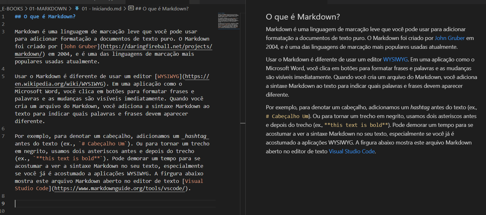
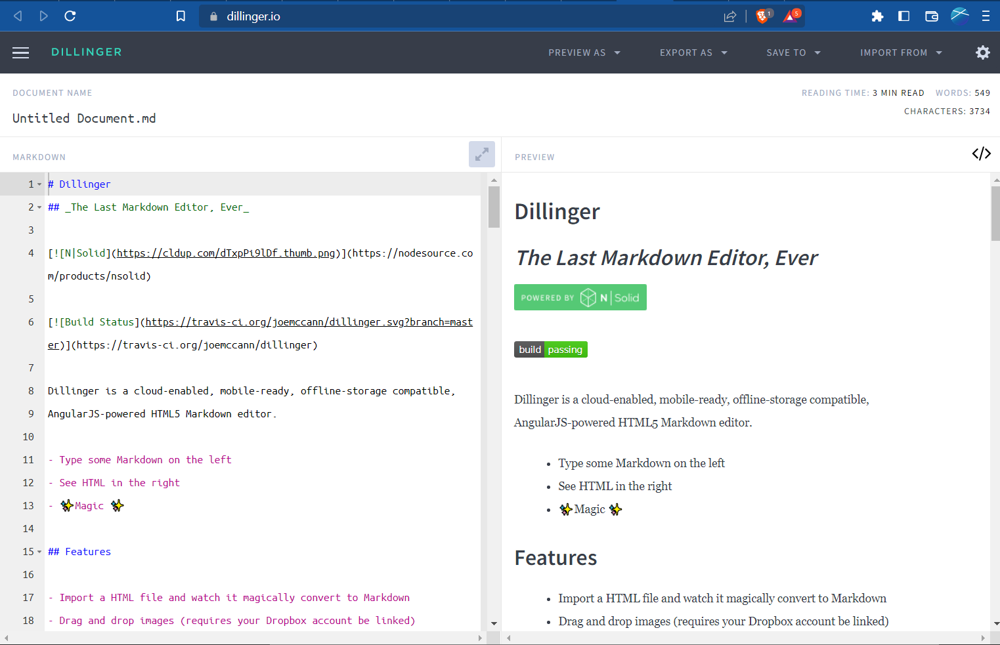
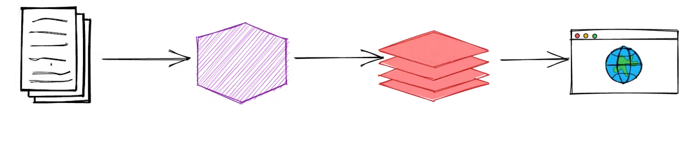

## O que é Markdown?

Markdown é uma linguagem de marcação leve que você pode usar para adicionar formatação a documentos de texto puro. O Markdown foi criado por [John Gruber](https://daringfireball.net/projects/markdown/) em 2004, e é uma das linguagens de marcação mais populares usadas atualmente.

Usar o Markdown é diferente de usar um editor [WYSIWYG](https://en.wikipedia.org/wiki/WYSIWYG). Em uma aplicação como o Microsoft Word, você clica em botões para formatar frases e palavras e as mudanças são visíveis imediatamente. Quando você cria um arquivo do Markdown, você adiciona a sintaxe Markdown ao texto para indicar quais palavras e frases devem aparecer diferente.

Por exemplo, para denotar um cabeçalho, adicionamos um _hashtag_ antes do texto (ex., `# Cabeçalho Um`). Ou para tornar um trecho em negrito, usamos dois asteriscos antes e depois do trecho (ex., `**this text is bold**`). Pode demorar um tempo para se acostumar a ver a sintaxe Markdown no seu texto, especialmente se você já é acostumado a aplicações WYSIWYG. A firgura abaixo mostra este arquivo Markdown aberto no editor de texto [Visual Studio Code](https://www.markdownguide.org/tools/vscode/).

Você pode formatar elementos de um arquivo de texto puro usando um editor de texto. Ou você pode usar uma das várias aplicações para os sistemas operacioanis macOS, Windows, Linux, iOS, e Android. Existem também várias aplicações web especificamente projetadas para escrita usando Markdown.

Dependendo da aplicação que você usa, você poderá não ver a pré-visualização do documento formatado em tempo real. Mas isso não é um problema. De acordo com [Gruber](https://daringfireball.net/projects/markdown/), a sintaxe Markdown é projetada para ser legível e não intrusiva, de forma que os arquivos de texto Markdown pode ser lidos mesmo quando não estão renderizados.

> O objetivo primordial do design para a sintaxe de formatação do Markdown é torná-lo o mais legível possível. A ideia é que um documento formatado em Markdown possa ser publicado como está, como texto simples, sem parecer que foi marcado com tags ou instruções de formatação.

## Por que usar Markdown?

Você deve estar se perguntando o porquê de usar Markdown ao invés de usar um editor WYSIWYG. Por que escrever em Markdown quando você pode pressionar botões para formatar seu texto? Existem diversas razões para isso:

- Markdown pode ser usado para qualquer coisa. Pessoas utilizam para criar websites, documentos, notas, livros, apresentações, mensagens de e-mail, e documentação técnica.

- Markdown é portável. Arquivos formatados com Markdown podem ser abertos em praticamente qualquer aplicação. Se você não estiver gostando da sua aplicação atual para trabalhar com Markdown, você pode importar seus arquivos para outra aplicação Markdown. Já se você estiver utilizando o Microsoft Work seu conteúdo fica preso um arquivo cujo formato é proprietário.

- Markdown é independente de plataforma. Você pode criar um texto formatado com Markdown em qualquer dispositivo rodando qualquer sistema operacional.

- Markdown é à prova do futuro. Mesmo se sua aplicação que você está utilizando pare de funcionar em um determinado ponto no furuto, você ainda será capaz de ler seu texto formatado com Markdown usando um aplicativo simples de edição de texto. Essa é uma consideração importante quando se trata de livros, teses universitárias e outros documentos importantes que precisam ser preservados indefinidamente.

- Markdown está em toda parte. Sites como [Reddit](https://www.reddit.com/) e [GitHub](https://github.com/) oferecem suporte ao Markdown, e muitos aplicativos de desktop e baseados na Web o suportam.

## Iniciando com o Markdown

A melhor maneira de começar a usar o Markdown é usá-lo. Isso é mais fácil do que nunca, graças a uma variedade de ferramentas gratuitas.

Você nem precisa baixar nada. Existem vários editores Markdown online que você pode usar para tentar escrever no Markdown. [Dillinger](https://dillinger.io/) é um dos melhores editores de Markdown online. Basta abrir o site e começar a digitar no painel esquerdo. Uma visualização do documento renderizado aparece no painel direito.

Você provavelmente desejará manter o site do Dillinger aberto enquanto lê este guia. Dessa forma, você pode experimentar a sintaxe à medida que aprende sobre ela. Depois de se familiarizar com o Markdown, você pode querer usar um aplicativo Markdown que pode ser instalado em seu computador desktop ou dispositivo móvel.

### Como funcionam os editores online

Dillinger facilita a escrita no Markdown porque esconde as coisas que acontecem nos bastidores, mas vale a pena explorar como o processo funciona em geral.

Quando você escreve no Markdown, o texto é armazenado em um arquivo de texto simples que possui uma extensão .md ou .markdown. Mas e daí? Como seu arquivo formatado em Markdown é convertido em HTML ou em um documento pronto para impressão?

A resposta curta é que você precisa de um aplicativo Markdown capaz de processar o arquivo Markdown. Há muitos aplicativos disponíveis — tudo, desde scripts simples até aplicativos de desktop que se parecem com o Microsoft Word. Apesar de suas diferenças visuais, todos os aplicativos fazem a mesma coisa. Como Dillinger, todos eles convertem texto formatado em Markdown em HTML para que possa ser exibido em navegadores da web.

Os aplicativos Markdown usam algo chamado processador Markdown (também conhecido como "analisador" ou "implementação") para pegar o texto formatado em Markdown e enviá-lo para o formato HTML. Nesse ponto, seu documento pode ser visualizado em um navegador da Web ou combinado com uma folha de estilo e impresso. Você pode ver uma representação visual desse processo abaixo.

> Observação: o aplicativo Markdown e o processador são dois componentes separados. Por uma questão de brevidade, combinei-os em um elemento ("aplicativo Markdown") na figura abaixo.

Para resumir, este é um processo de quatro partes:

1. Crie um arquivo Markdown usando um editor de texto ou um aplicativo Markdown dedicado. O arquivo deve ter uma extensão .md ou .markdown.
2. Abra o arquivo Markdown em um aplicativo Markdown.
3. Use o aplicativo Markdown para converter o arquivo Markdown em um documento HTML.
4. Visualize o arquivo HTML em um navegador da Web ou use o aplicativo Markdown para convertê-lo em outro formato de arquivo, como PDF.

Do seu ponto de vista, o processo varia um pouco dependendo do aplicativo que você usa. Por exemplo, Dillinger combina essencialmente as etapas 1 a 3 em uma interface única e contínua - tudo o que você precisa fazer é digitar no painel esquerdo e a saída renderizada aparece magicamente no painel direito. Mas se você usar outras ferramentas, como um editor de texto com um gerador de sites estáticos, verá que o processo é muito mais visível.

## Variações do Markdown

Um dos aspectos mais confusos do uso do Markdown é que praticamente todos os aplicativos Markdown implementam uma versão ligeiramente diferente do Markdown. Essas variantes do Markdown são comumente chamadas de sabores. É seu trabalho dominar qualquer tipo de Markdown que seu aplicativo tenha implementado.

Para entender o conceito de tipos Markdown, pode ser útil pensar neles como dialetos de linguagem. As pessoas na cidade de Nova York falam inglês exatamente como as pessoas em Londres, mas há diferenças substanciais entre os dialetos usados nas duas cidades. O mesmo vale para pessoas que usam diferentes aplicativos Markdown. Usar [Dillinger](https://www.markdownguide.org/tools/dillinger/) para escrever com Markdown é uma experiência muito diferente de usar [Ulysses](https://www.markdownguide.org/tools/ulysses/).

Em termos práticos, isso significa que você nunca sabe exatamente o que uma empresa quer dizer quando diz que apoia o "Markdown". Eles estão falando apenas sobre os [elementos de sintaxe básicos](https://www.markdownguide.org/basic-syntax/), ou todos os [elementos de sintaxe básicos e estendidos](https://www.markdownguide.org/extended-syntax/) combinados, ou alguma combinação arbitrária de elementos de sintaxe? Você não saberá até ler a documentação ou começar a usar o aplicativo.

Se você está apenas começando, o melhor conselho que posso dar é escolher um aplicativo Markdown com bom suporte Markdown. Isso ajudará muito a manter a portabilidade de seus arquivos Markdown. Você pode querer armazenar e usar seus arquivos Markdown em outros aplicativos e, para fazer isso, precisa começar com um aplicativo que forneça um bom suporte.

## Recursos adicionais

Existem muitos recursos que você pode usar para aprender o Markdown. Aqui estão alguns outros recursos introdutórios:

- [Documentação Markdown de John Gruber](https://daringfireball.net/projects/markdown/). O guia original escrito pelo criador do Markdown.
- [Markdown Tutorial](https://www.markdowntutorial.com/). Um site de código aberto que permite que você experimente o Markdown em seu navegador da web.
- [Awesome Markdown](https://github.com/mundimark/awesome-markdown). Uma lista de ferramentas Markdown e recursos de aprendizagem.
- [Typesetting Markdown](https://dave.autonoma.ca/blog/2019/05/22/typesetting-markdown-part-1). Uma série de várias partes que descreve um ecossistema para composição de documentos Markdown usando [pandoc](https://pandoc.org/) e [ConTeXt](https://www.contextgarden.net/).
